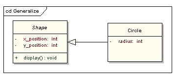

# Thinking-in-UML

## 一. RUP 4+1视图模型
1995年，Philippe Kruchten在《IEEE Software》上发表的《The 4+1 View Model of Architecture》
https://www.cs.ubc.ca/~gregor/teaching/papers/4+1view-architecture.pdf


## 二. UML

### 1. 关系 Relationship


#### 关联关系 Association

**关联关系** 是静态关系，是由“常识“，“规则”，“法律”等决定。
关联表明两个模型元素之间有关系，通常用在一个类中被实现为一个实例变量。


```java
class Team {   
    Player player;   
}
```
#### 聚合关系 Aggregation

**聚合关系** 通常被用来描述由更小的组件所构成的元素，是整体与部分的关系。


```java
class Team {   
    public Player player;   
    public void Team(Play player)
    {
        this.player = player;
    }
}
```
#### 组合关系 Composition

**组合关系**是一种强依赖的特殊聚合关系，如果整体不在了，部分也将消亡。


```java
class Person {   
    public Head head;   
    public Body body;   
    public Hands hands;   
    public Foots foots;   
    public void Person()
    {
        this.head = new Head();
        this.body = new Body();
        this.hands = new Hands();
        this.foots = new Foots();
    }
}
```
#### 依赖关系 Dependency

**依赖关系** 描述一个对象在运行时会使用另外一个对象的关系。
与关联关系不同，是一种临时关系，在运行期间产生，随着场景不同而变化。


```java
class Person {   
    public void drive(Car car)
    {
        car.run();
    }
    public void fly()
    {
        Plane plane = new Plane();
        plane.run();
    }
}
```
* * * 
  
**聚合和组合都属于关联关系，区别就是生命周期的差异。**

> 国际关系比喻 
* 欧盟关系是聚合；
* 台海关系是组合；
* 各国和中东的关系是依赖；
* 一带一路的关系是关联；
> 代码体现 
* 一个类的对象是另外一个类的成员变量，是关联
     * 这个对象是参数传递进来是聚合
     * 这个对象是内部实例化的是组合 
* 一个类的对象是另外一个类的局部变量，是依赖


#### 泛化关系 Generalization
**泛化关系**一般元素和特殊元素之间的分类关系

#### 实现关系 Realization


### 2. 图 Diagrams

#### 用例图 Use Case Diagram
